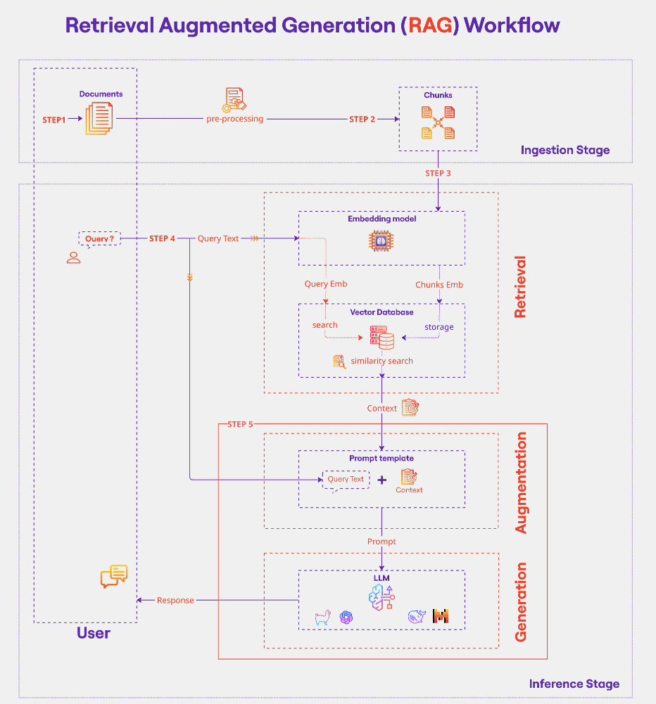

# Retrieval-Augmented Generation: Core Concepts

## Limitations of large language models

Large language models are capable, but on their own they:

- Know nothing outside their training data, for example recent or private information.
- Are not specialised for a particular use case.
- Can hallucinate confidently, which may lead to misinformation.
- Produce black-box output: they do not show what led to a particular answer.

## What is RAG?

Retrieval-Augmented Generation combines retrieval-based and generative techniques. It enhances a language model with an external knowledge source: relevant documents are retrieved and supplied to the model alongside the question, which improves accuracy and reduces hallucination.

The diagram below shows the full workflow, from ingesting documents into a vector store to retrieving context and generating a grounded answer. The notebooks build this pipeline step by step.

## Fine-tuning vs RAG

### Fine-tuning

- Adapts a model to a specific use case through further training (transfer learning).
- Changes the model parameters, which can improve speed and cost for that task.
- Suits static knowledge, for example specialised terminology.
- Limitation: it cannot supply up-to-date information.

### Retrieval-Augmented Generation

- Extends the model by retrieving external, up-to-date information, augmenting the prompt with it, and generating an answer grounded in both.
- Needs no further training: the model parameters stay unchanged.
- Produces more transparent output with fewer hallucinations.
- Suits real-time, changing knowledge.

A short rule of thumb: fine-tune to change how the model behaves, use RAG to change what the model knows.

## Key components of RAG

- **Embedding models**: convert text into numerical vectors so that similar passages sit close together.
- **Vector stores and databases**: hold the embeddings for fast similarity search (FAISS, Chroma, Pinecone, Weaviate, and similar).
- **Retriever**: fetches the most relevant passages for a query.
- **LLM (generator)**: produces the final answer using the retrieved passages.

## Evaluating a RAG pipeline

A RAG pipeline has two stages, and you evaluate them separately.

- **Retrieval quality**: did the retriever fetch the right context? Common measures are context precision and recall, hit rate, and ranking metrics such as Mean Reciprocal Rank. If retrieval brings back the wrong passages, the generator cannot recover.
- **Generation quality**: did the model use that context well? The two questions here are faithfulness (is the answer grounded in the retrieved context rather than hallucinated?) and answer relevancy (does it actually address the question?).

How you measure it depends on what you have. With reference answers you can score the output directly. Without them, a common approach is LLM-as-judge, where a model rates the answer against the context, and frameworks such as [RAGAS](https://docs.ragas.io/) package these metrics so you do not implement them yourself.

## Common use cases

- Enterprise document search across company policies and research papers.
- Chatbots with domain-specific knowledge (customer support, legal, medical).
- Coding assistants that fetch relevant snippets from documentation.
- Financial report analysis, such as summarising earnings reports and news.
- E-learning and research assistants.

For a fuller picture of where RAG is deployed in industry, see [Real-World Applications](6_rag_real_world_applications.md).
